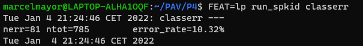
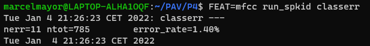

PAV - P4: reconocimiento y verificación del locutor
===================================================

Obtenga su copia del repositorio de la práctica accediendo a [Práctica 4](https://github.com/albino-pav/P4)
y pulsando sobre el botón `Fork` situado en la esquina superior derecha. A continuación, siga las
instrucciones de la [Práctica 2](https://github.com/albino-pav/P2) para crear una rama con el apellido de
los integrantes del grupo de prácticas, dar de alta al resto de integrantes como colaboradores del proyecto
y crear la copias locales del repositorio.

También debe descomprimir, en el directorio `PAV/P4`, el fichero [db_8mu.tgz](https://atenea.upc.edu/pluginfile.php/3145524/mod_assign/introattachment/0/spk_8mu.tgz?forcedownload=1)
con la base de datos oral que se utilizará en la parte experimental de la práctica.

Como entrega deberá realizar un *pull request* con el contenido de su copia del repositorio. Recuerde
que los ficheros entregados deberán estar en condiciones de ser ejecutados con sólo ejecutar:

~~~~~~~~~~~~~~~~~~~~~~~~~~~~~~~~~~~~~~~~~~~~~~~~~~~~~.sh
  make release
  run_spkid mfcc train test classerr verify verifyerr
~~~~~~~~~~~~~~~~~~~~~~~~~~~~~~~~~~~~~~~~~~~~~~~~~~~~~

Recuerde que, además de los trabajos indicados en esta parte básica, también deberá realizar un proyecto
de ampliación, del cual deberá subir una memoria explicativa a Atenea y los ficheros correspondientes al
repositorio de la práctica.

A modo de memoria de la parte básica, complete, en este mismo documento y usando el formato *markdown*, los
ejercicios indicados.

## Ejercicios.

### SPTK, Sox y los scripts de extracción de características.

- Analice el script `wav2lp.sh` y explique la misión de los distintos comandos involucrados en el *pipeline*
  principal (`sox`, `$X2X`, `$FRAME`, `$WINDOW` y `$LPC`). Explique el significado de cada una de las 
  opciones empleadas y de sus valores.

  - **sox**: A partir de una señal de entrada de audio sirve para convertirla en otra según un formato en concreto, por ejemplo, te permite modificar archivo de audio (-t), el tipo de codificación (-e), el número de bits (-b), y entre muchas más opciones. En nuestro caso, convierte un archivo WAVE a raw, codificación signed y de 16 bits.

  - **$X2X**: Convierte los datos de una entrada estándar a distintos tipos de datos, enviando el resultado a la salida estándar. En nuestro caso, la conversión de datos es a short format (+sf).

  - **$FRAME**: Convierte una secuencia de datos de entrada de archivo (o entrada estándar) a un conjunto de frames posiblemente superpuestos, con período (-p) P y longitud (-l) L, y envía el resultado a la salida estándar. En nuestro caso, utilizamos un periodo de 80 muestras y longitud de 240 muestras.

  - **$WINDOW**: Multiplica, elemento por elemento, los vectores de entrada de archivo de longitud incial (-l) L1 (o entrada estándar) mediante una función de ventana especificada, enviando el resultado a la salida estándar de longitud (-L) L2. Se utiliza la ventana de Blackman por defecto. En nuestro caso, el tamaño de entrada y salida es el mismo, 240 muestras.

  - **$LPC**: Calcula coeficientes de predicción lineal (LPC) usando el método Levinson-Durbin a partir de datos en ventana enmarcados de longitud L desde *infile* (o entrada estándar), enviando el resultado a la salida estándar. Con ayuda de las opciones fijamos la longitud del frame (-l) y el orden del LPC (-m). En nuestro caso, a 240 muestras y la variable $lpc_order indica el orden, respectivamente.

- Explique el procedimiento seguido para obtener un fichero de formato *fmatrix* a partir de los ficheros de
  salida de SPTK (líneas 45 a 47 del script `wav2lp.sh`).

  Con las primeras lineas (42-43), obtenemos el fichero $base.lp con los coeficientes LPC, encadenando los comandos descritos en el apartado anterior.
  
  A continuación (45-47), fijamos una cabecera para el archivo de salida con el número de filas (nrow) y columnas (ncol) de la matriz. El número de columnas será el orden del LPC + 1, ya que en la primera columna encontraremos el factor de ganancia de predicción. El número de filas será el número total de tramas a las que se les ha calculado los coeficientes LPC. Lo extraemos del fichero .lp convirtiendo el contenido a ASCII con X2X +fa y contando el número de líneas con el comando wc -l.

  * ¿Por qué es conveniente usar este formato (u otro parecido)? Tenga en cuenta cuál es el formato de
    entrada y cuál es el de resultado.

    De esta manera los datos se almacenan en nrow filas de ncol columnas, en los que cada fila corresponde a una trama de señal, y cada columna a cada uno de los coeficientes con los se parametriza la trama. Es una manera fácil de acceder a todos los datos almacenados con una correspondencia directa entre la posición en la matriz y el orden del coeficiente y número de trama, por lo que simplifica mucho su manipulación a la hora de trabajar.

- Escriba el *pipeline* principal usado para calcular los coeficientes cepstrales de predicción lineal
  (LPCC) en su fichero <code>scripts/wav2lpcc.sh</code>:

  <code>sox $inputfile -t raw -e signed -b 16 - | $X2X +sf | $FRAME -l 240 -p 80 | $WINDOW -l 240 -L 240 |
   $LPC -l 240 -m $lpc_order | $LPCC -m $lpc_order -M $cepstrum_order > $base.lpcc</code>

- Escriba el *pipeline* principal usado para calcular los coeficientes cepstrales en escala Mel (MFCC) en su
  fichero <code>scripts/wav2mfcc.sh</code>:

  <code>sox $inputfile -t raw -e signed -b 16 - | $X2X +sf | $FRAME -l 240 -p 80 | $WINDOW -l 240 -L 240 |
   $MFCC -l 240 -m $mfcc_order -n $num_filters -s $sampl_freq > $base.mfcc</code>

### Extracción de características.

- Inserte una imagen mostrando la dependencia entre los coeficientes 2 y 3 de las tres parametrizaciones
  para todas las señales de un locutor.

  Hemos elegido los ficheros del locutor SES000 y hemos representado los dos coeficientes mediante un código Matlab/Octave.
  
  + Indique **todas** las órdenes necesarias para obtener las gráficas a partir de las señales 
    parametrizadas.
    
    Para la parametrización LP:
    **~/PAV/P4$ fmatrix_show work/lp/BLOCK00/SES000/*.lp | egrep '^\[' | cut -f4,5 > lp_2_3.txt**
    
    <kbd></kbd>
    
    Para la parametrización LPCC:
    **~/PAV/P4$ fmatrix_show work/lpcc/BLOCK00/SES000/*.lpcc | egrep '^\[' | cut -f4,5 > lpcc_2_3.txt**
    
    <kbd></kbd>
    
    Para la parametrización MFCC:
    **~/PAV/P4$ fmatrix_show work/mfcc/BLOCK00/SES000/*.mfcc | egrep '^\[' | cut -f4,5 > mfcc_2_3.txt**
    
    <kbd></kbd>

  + ¿Cuál de ellas le parece que contiene más información?
  
  A partir de las tres gráficas podríamos decir que las parametrizaciones LPCC y MFCC contienen más información ya que tienen mayor dispersión, es decir, hay una baja correlación entre componentes. Esto implica que el valor de una de ellas es fácilmente estimable a partir el valor de la otra. No obstante, MFCC tiene una mayor area de dispersión.
  
  En cambio, observando la parametrización LP sus coeficientes estén muy correlados (o sea, sus valores forman una linea estrecha). Esto quiere decir que conociendo el valor de un coeficiente podemos determinar el valor del otro.
  , por lo tanto con solo uno obtendríamos la misma información.
  
  En definitiva, la parametrización MFCC es la que aporta más información, seguido de LPCC y finalmente LP.

- Usando el programa <code>pearson</code>, obtenga los coeficientes de correlación normalizada entre los
  parámetros 2 y 3 para un locutor, y rellene la tabla siguiente con los valores obtenidos.
  
  **~/PAV/P4$ pearson work/lp/BLOCK00/SES000/*.lp**
  
  **~/PAV/P4$ pearson work/lpcc/BLOCK00/SES000/*.lpcc**
  
  **~/PAV/P4$ pearson work/mfcc/BLOCK00/SES000/*.mfcc**

  |                        | LP   | LPCC | MFCC |
  |------------------------|:----:|:----:|:----:|
  | &rho;x[2,3] |   -0.818326  | 0.217792     |   0.0418471   |
  
  + Compare los resultados de <code>pearson</code> con los obtenidos gráficamente.

  El coeficiente Pearson está acotado −1 <= ρij <= 1. Un valor cercano a ±1 implica una alta correlación entre componentes. Por el contrario, si ρij ≈ 0, entonces las dos componentes están poco correladas. Podemos ver que que MFCC es la menor correlada (mayor información), seguido de LPCC y finalmente LP, tal como se vio en las gráficas anteriores.
  
- Según la teoría, ¿qué parámetros considera adecuados para el cálculo de los coeficientes LPCC y MFCC?

  - Para LPCC, normalmente el número de coeficientes de predicción es igual a la frec. de muestreo expresada en kHz, ya que el sonido recprre 2 veces la longitud de un tracto vocal medio en 1ms. No obstante, es común entre 8 y 12 coeficientes (lpc_order), y 3/2·lpc_order coeficientes cepstrales (cepstrum_order) *aproximadamente*.

  - Para MFCC, se utilizan entre 13 y 20 coeficientes para reconocimiento del habla (mfcc_order). Normalmente, los primeros 13 coeficientes. El número de filtros triangulares del banco en escala Mel varía entre 24 y 40 (num_filters). El rango de frecuencias comunmente utilizado es entre 8kHz y 22kHz (freq_samp).

### Entrenamiento y visualización de los GMM.

Complete el código necesario para entrenar modelos GMM.

- Inserte una gráfica que muestre la función de densidad de probabilidad modelada por el GMM de un locutor
  para sus dos primeros coeficientes de MFCC.
  
  ***~/PAV/P4$ plot_gmm_feat work/gmm/mfcc/SES000.gmm***

  <kbd></kbd>

- Inserte una gráfica que permita comparar los modelos y poblaciones de dos locutores distintos (la gŕafica
  de la página 20 del enunciado puede servirle de referencia del resultado deseado). Analice la capacidad
  del modelado GMM para diferenciar las señales de uno y otro.

  <kbd></kbd>

  En la gráfica podemos ver las regiones con el 99 %, 90 % y 50 % de la masa de probabilidad para los GMM de los locutores SES000 (en rojo, arriba) y SES005 (en azul, abajo); también se muestra la población del usuario SES000 (en rojo, izquierda) y SES005 (en azul, derecha).

  Existen diferencias en la función de densidad de los dos locutores, pero lo cierto es que la diferencia es muy sutil. Esta poca información en ellas, sólo nos indica lo difícil que es la tarea de reconocer el locutor a partir de estas features. No obstante, esta es la sutil diferencia, en las áreas distintas del ruido de fondo, la que permitirá usar los modelos para determinar si una señal pertenece a uno u otro locutor.

### Reconocimiento del locutor.

Complete el código necesario para realizar reconociminto del locutor y optimice sus parámetros.

- Inserte una tabla con la tasa de error obtenida en el reconocimiento de los locutores de la base de datos
  SPEECON usando su mejor sistema de reconocimiento para los parámetros LP, LPCC y MFCC.

  Para el entrenamiento, inicializamos con el metodo VQ, utilizamos 40 gaussianas e iteramos 50 veces esteblecido un umbral de 1e-6.
  
  Para la parametrización LP, obtenemos el mejor resultado con los 8 coeficientes de predicción (igual a la frec. de muestreo expresada en kHz).

  <kbd></kbd>

  Para la paremetrización LPCC, obtenemos el mejor resultado con 8 coeficientes de predicción y 13 coeficientes cepstrales, común en reconocimiento de voz.

  <kbd></kbd>

  Para la paremetrización MFCC, obtenemos el mejor resultado con un filtro de orden 16, un banco de 20 filtros y una frecuencia de muestreo de 22kHz útil para la reducción de la tasa de error relativo causado por el ancho de banda.

  <kbd></kbd>

  |                        | LP   | LPCC | MFCC |
  |------------------------|:----:|:----:|:----:|
  | error_rate |   10.32%  | 2.93%     | 1.40%     |

### Verificación del locutor.

Complete el código necesario para realizar verificación del locutor y optimice sus parámetros.

- Inserte una tabla con el *score* obtenido con su mejor sistema de verificación del locutor en la tarea
  de verificación de SPEECON. La tabla debe incluir el umbral óptimo, el número de falsas alarmas y de
  pérdidas, y el score obtenido usando la parametrización que mejor resultado le hubiera dado en la tarea
  de reconocimiento.

  Para la parametrización LP, el resultado de la verificación es el siguiente:

  <kbd></kbd>

  Para la parametrización LPCC, el resultado de la verificación es el siguiente:

  <kbd></kbd>

  Para la parametrización MFCC, el resultado de la verificación es el siguiente:

  <kbd></kbd>

  Podemos ver que el mejor resultado lo obtenemos con la parametrización MFCC.
 
### Test final

- Adjunte, en el repositorio de la práctica, los ficheros `class_test.log` y `verif_test.log` 
  correspondientes a la evaluación *ciega* final.

### Trabajo de ampliación.

- Recuerde enviar a Atenea un fichero en formato zip o tgz con la memoria (en formato PDF) con el trabajo 
  realizado como ampliación, así como los ficheros `class_ampl.log` y/o `verif_ampl.log`, obtenidos como 
  resultado del mismo.
